#Overview

##Introduction

###What's in the box
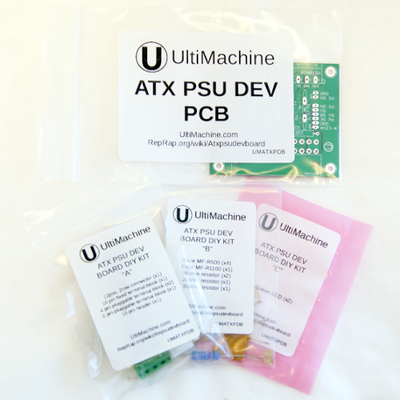

##Assembly
###Preparation
####Tools
The following tools and materials are required to assemble the ATX PSU Dev Board:

- Soldering Iron
- Solder
- Flush/diagonal cutters

Additional tools that might be helpful, but not required:

- Lead bender (some 3D printable ones can be found online)

####Soldering
If you do not have prior experience soldering, we recommend checking out a few of the following websites for tutorials.

- <http://mightyohm.com/files/soldercomic/FullSolderComic_EN.pdf>
- <http://www.ladyada.net/media/common/soldering.pdf>
- <http://store.curiousinventor.com/guides/How_to_Solder>
- <http://www.sparkfun.com/tutorials/106>
- <http://radiojove.gsfc.nasa.gov/telescope/soldering.htm>

###Assembly
The components of this board will be inserted on the side with the outlines

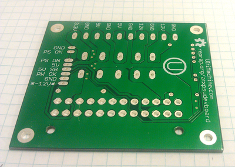 
  
Begin by inserting the two 1k ohm resistors and the LEDs into the board. The LEDs should have the longest lead in the hole facing the resistor. If they are inserted incorrectly they will not work. This is because they are diodes. Resistors are not polarized components, so they can be inserted in orientation.

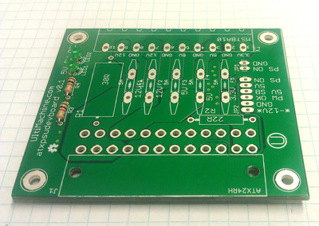

Next flip over the board and solder the components in.

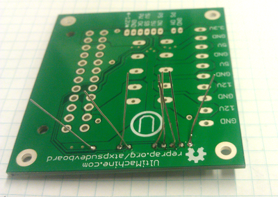

Now that the components are soldered in and secure you can cut the leads.

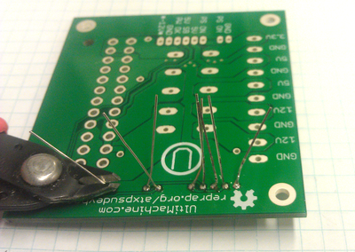

The fuses will be inserted next. They have a coating that slightly descends down the leads.

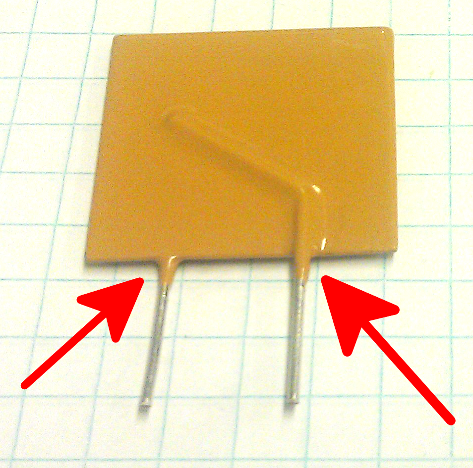

In order to make a good connection the fuses should slightly hover over the holes. This is so the coating on the leads does not interfere with soldering. You want to bring the fuse above the board. This can be done with RepRap filament or something else, such as a long screw. The orientation of the fuses does not matter. 

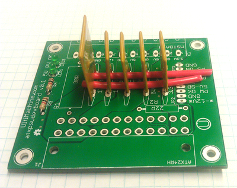

You can remove the filament.

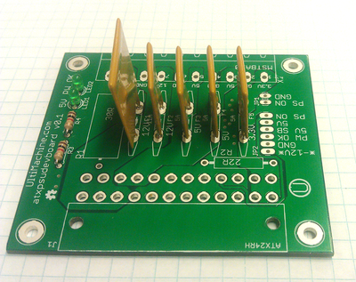

Now is a good opportunity to check that all connections were soldered well. Ideally the solder should wick up the lead onto the other side of the board. It should also have a nice tapered look. Add some flux and reheat the joint to touch-up the connections if needed. \\

Now is a good opportunity to inspect the solder joints. Since the connectors and fuses on this board might carry as much as 10 amps you want a good solder connection. You can check the quality of the solder joint by looking at the other side of the leads. A good connection is shown on the left lead, with a potentially weak one on the right lead.

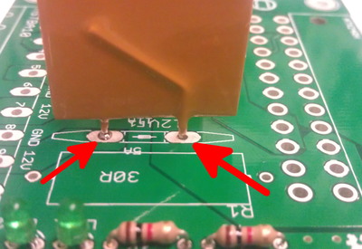

Next you will want to solder in the remaining resistors. Again, orientation does not matter for resistors.

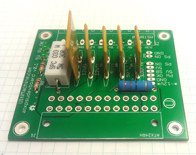 

Next locate the header pins in the parts bag. You will need to break them into a strip of 6 and 2 as shown below. This can be done with flush cutters.

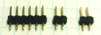 

Solder the header pins as shown.

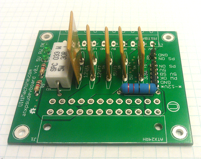 

Add the recieving end for the pluggable headers.

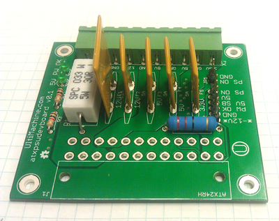 

Next you will want to add the ATX connector. It has barbs on the housing that should clip onto the circuit board. Make sure the connector is well seated before soldering.

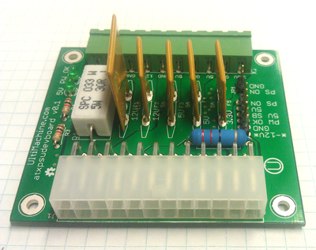 
 
You have now completed assembly of the ATX PSU Dev Board!
 
#Usage
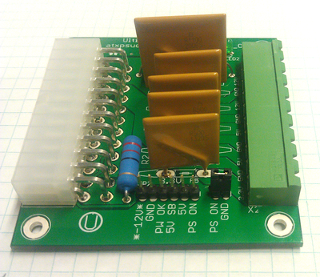 

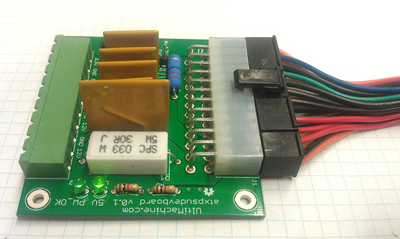

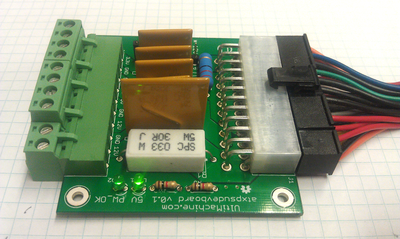

#Source

